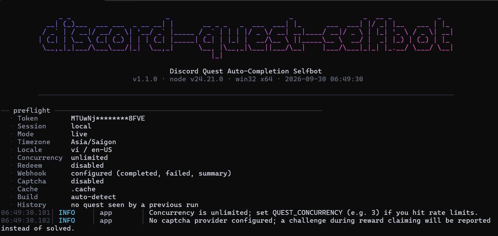
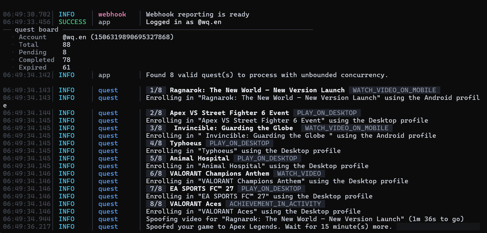

<div align="center">

# Discord Quest Auto-Completion Selfbot

A typed, structured and extensible selfbot framework for automating active Discord Quests.

<p>
  = 24">
  
  
  
  
</p>

<p>
  <a href="#-overview">Overview</a>
  &nbsp;·&nbsp;
  <a href="#-features">Features</a>
  &nbsp;·&nbsp;
  <a href="#-supported-task-types">Supported Tasks</a>
  &nbsp;·&nbsp;
  <a href="#-architecture">Architecture</a>
  &nbsp;·&nbsp;
  <a href="#-installation">Installation</a>
  &nbsp;·&nbsp;
  <a href="#-configuration">Configuration</a>
  &nbsp;·&nbsp;
  <a href="#-usage">Usage</a>
  &nbsp;·&nbsp;
  <a href="#-development">Development</a>
  &nbsp;·&nbsp;
  <a href="#-troubleshooting">Troubleshooting</a>
  &nbsp;·&nbsp;
  <a href="#-security--disclaimer">Security</a>
</p>

</div>

---

## 📸 Showcase

<div align="center">
  
  
</div>

<p align="center">
  <sub>Live console interface: Quest Board (left) and Run Summary (right)</sub>
</p>

---

## ⚠️ Security & Disclaimer

> [!WARNING]
> **Using a selfbot violates the [Discord Terms of Service](https://discord.com/terms) and [Developer Terms](https://discord.com/developers/docs/policies-and-agreements/developer-terms-of-service).**
>
> **This can lead to permanent account suspension.** Use at your own risk.
>
> As of April 7th 2026, Discord has publicly stated their intent to crack down on quest automation. Some users have received system warnings.

> [!CAUTION]
> **I take no responsibility for accounts that get blocked, flagged, or suspended for using this software.**
>
> - Do not use on accounts you value
> - Consider using a dedicated alt account
> - Run behind a proxy if possible
> - Keep the token secure — never commit `.env` files

---

## 📖 Overview

**Discord Quest Auto-Completion Selfbot** is a minimal, type-safe selfbot framework built on top of Discord's official core libraries (`@discordjs/core`, `@discordjs/rest`, `@discordjs/ws`).

### Design Principles

| Principle | Implementation |
|-----------|----------------|
| **Type Safety** | Strict TypeScript, Zod-validated config, explicit domain models |
| **Explicit Configuration** | All env vars validated at startup, single source of truth in `src/core/_config.ts` |
| **Predictable Orchestration** | Quest manager with deterministic enrollment → execution → reporting flow |
| **Observability** | Structured JSON logs, coloured console UI, optional Discord webhook reports |
| **Reliability** | Retry with exponential backoff, timeouts, graceful shutdown on SIGINT/SIGTERM |
| **Extensibility** | Plugin-based captcha providers, modular task handlers |

Based on the original work by [amia](https://gist.github.com/aamiaa/204cd9d42013ded9faf646fae7f89fbb).ed Task Types

| Task                                     | Status | Notes                                 |
| ---------------------------------------- | :----: | ------------------------------------- |
| `WATCH_VIDEO`                            |    ✅   | Paced video progress                  |
| `WATCH_VIDEO_ON_MOBILE`                  |    ✅   | Uses the Android fingerprint          |
| `PLAY_ON_DESKTOP` / `PLAY_ON_DESKTOP_V2` |    ✅   | Heartbeat-based progress              |
| `PLAY_ON_XBOX`                           |   ⚠️   | Untested                              |
| `PLAY_ON_PLAYSTATION`                    |   ⚠️   | Untested                              |
| `PLAY_ACTIVITY`                          |   ⚠️   | Untested                              |
| `ACHIEVEMENT_IN_ACTIVITY`                |    ✅   | OAuth → activity bridge → deauthorize |
| `ACHIEVEMENT_IN_GAME`                    |    ❌   | Detected and reported as unsupported  |
| `STREAM_ON_DESKTOP`                      |    ❌   | Requires the desktop voice client     |

Unsupported tasks are detected, shown in the final summary and skipped without aborting the run.

---

## Console UI

The application starts with a centered wordmark, followed by a preflight block, live quest board, progress output and a final summary.

```text
                                  Discord Quest Auto-Completion Selfbot

                           v1.1.0 · node v24.21.0 · win32 x64 · 2026-09-30
        ─────────────────────────────────────────────────────────────────────────────────────

        ── preflight ─────────────────────────────────────────────────────────────────────────
          · Token         MTIzND********3456
          · Session       local
          · Timezone      Asia/Saigon
          · Locale        vi / en-US
          · Concurrency   unlimited
          · Redeem        disabled
          · Webhook       disabled
          · Captcha       manual
          · Build         auto-detect

        ── quest board ───────────────────────────────────────────────────────────────────────
          · Account       @example (1234567890)
          · Total         9
          · Pending       6
          · Completed     1
          · Expired       2

        06:04:50.118 │ INFO    │ quest    │ Enrolling in "Opera GX" using the Desktop profile
        06:04:50.121 │ INFO    │ quest    │ Spoofing video for "Opera GX" (15m 00s to go)
        06:04:50.129 │ SUCCESS │ quest    │ Quest "Opera GX" completed
```

### Log format

```text
HH:MM:SS.mmm │ LEVEL   │ scope     │ message
```

The logger provides:

* `INFO` in cyan
* `SUCCESS` in green
* `WARN` in amber
* `ERROR` in red
* `FATAL` in inverted red
* Stable colours per scope such as `quest`, `enroll`, `reward`, `captcha`, `http` and `webhook`

For compatibility and machine-readable output:

```text
LOG_ASCII=true
LOG_JSON=true
```

`LOG_ASCII=true` replaces box-drawing glyphs with ASCII characters, while `LOG_JSON=true` emits newline-delimited JSON records.

---

## Project Structure

```text
Discord-Quest-Auto-Completion-Selfbot/
├── bot.ts
├── src/
│   ├── _app.ts
│   ├── core/
│   │   ├── _client.ts
│   │   ├── _config.ts
│   │   └── _constants.ts
│   ├── domain/
│   │   ├── _quest.ts
│   │   ├── _quest-manager.ts
│   │   └── _types.ts
│   ├── providers/
│   │   └── _yes-captcha.ts
│   ├── services/
│   │   ├── _build-info.ts
│   │   ├── _captcha.ts
│   │   ├── _discord-says.ts
│   │   └── _reporter.ts
│   ├── ui/
│   │   ├── _banner.ts
│   │   ├── _logger.ts
│   │   ├── _progress.ts
│   │   └── _theme.ts
│   └── utils/
│       ├── _async.ts
│       ├── _headers.ts
│       ├── _http.ts
│       └── _time.ts
```

---

## Installation

> [!NOTE]
> **Node.js 24.0.0 or newer is required.**

### 1. Install dependencies

```sh
npm install
```

### 2. Configure your environment

Copy `.env.example` to `.env` and fill in `TOKEN`.

### 3. Start the application

```sh
npm run start
```

A missing or malformed token does not crash the process. The run stops with a readable `CANNOT START` panel listing the detected problems.

---

## Configuration

Everything is optional except `TOKEN`.

See `.env.example` for the commented template.

| Variable                  | Default       | Purpose                                                                  |
| ------------------------- | ------------- | ------------------------------------------------------------------------ |
| `TOKEN`                   | —             | **Required.** Raw user token. Never add the `Bot ` prefix.               |
| `WEBHOOK_URL`             | —             | Discord webhook used for completion reports and the run summary.         |
| `YES_CAPTCHA_API_KEY`     | —             | Enables automatic hCaptcha solving when claiming a reward.               |
| `REDEEM_REWARDS`          | `false`       | Also claim rewards for quests that are already completed.                |
| `QUEST_CONCURRENCY`       | `0`           | Maximum concurrent quest workers; `0` keeps the unbounded fan-out.       |
| `QUEST_INCLUDE`           | —             | Process only these quest IDs, space/comma separated.                     |
| `QUEST_EXCLUDE`           | —             | Skip these quest IDs.                                                    |
| `FETCH_EXCLUDED_QUESTS`   | `false`       | Also resolve quests the account cannot participate in.                   |
| `CLIENT_BUILD_NUMBER`     | `auto`        | Pin the fingerprint build number instead of scraping it.                 |
| `DISCORD_TIMEZONE`        | `Asia/Saigon` | `x-discord-timezone` request header.                                     |
| `DISCORD_LOCALE`          | `en-US`       | `x-discord-locale` request header.                                       |
| `DISCORD_ACCEPT_LANGUAGE` | `vi`          | `accept-language` request header.                                        |
| `LOG_LEVEL`               | `info`        | `trace`, `debug`, `info`, `success`, `warn`, `error`, `fatal`, `silent`. |
| `LOG_JSON`                | `false`       | Emit newline-delimited JSON records instead of decorated text.           |
| `LOG_ASCII`               | `false`       | Use ASCII-only glyphs for legacy consoles.                               |
| `LOG_COLOR`               | `auto`        | Force colour on/off. `NO_COLOR` and `FORCE_COLOR` are honoured.          |
| `LOG_TIMESTAMPS`          | `true`        | Prefix every record with `HH:MM:SS.mmm`.                                 |
| `HTTP_TIMEOUT_MS`         | `20000`       | Timeout for non-REST calls such as assets, activity proxy and captcha.   |
| `HTTP_RETRIES`            | `2`           | Retry attempts for transient HTTP failures.                              |
| `HTTP_RETRY_DELAY_MS`     | `700`         | Base delay for retry backoff.                                            |

---

## Example Output

```text
── quest board ────────────────────────────────────────────────────────────────

  · Account        @example (1234567890)
  · Total          9
  · Pending        6
  · Completed      1
  · Expired        2

06:04:50.110 │ INFO    │ quest     │ Found 6 valid quests to process with unbounded concurrency.
06:04:50.118 │ INFO    │ quest     │ 1/6  Opera GX  WATCH_VIDEO
06:04:50.119 │ INFO    │ quest     │ Enrolling in "Opera GX" using the Desktop profile
06:04:50.201 │ INFO    │ quest     │ Spoofing video for "Opera GX" (15m 00s to go)
06:04:50.205 │ INFO    │ quest     │ 2/6  Amazon  PLAY_ON_DESKTOP
06:04:50.280 │ INFO    │ quest     │ Spoofed your game to Amazon. Wait for 15 minute(s) more.
06:04:57.300 │ INFO    │ quest     │ Watching "Opera GX"  ███░░░░░░░░░░░░░░░░░░░░░  12%
...
06:19:35.980 │ SUCCESS │ quest     │ Quest "Opera GX" completed
06:19:36.010 │ SUCCESS │ quest     │ Quest "Amazon" completed

── run summary ────────────────────────────────────────────────────────────────

┌────────────────────┬─────────────────────────┬────────────┬──────────────┐
│ Quest              │ Task                    │ Status     │ Detail       │
├────────────────────┼─────────────────────────┼────────────┼──────────────┤
│ Opera GX           │ WATCH_VIDEO              │ completed  │ task finished │
│ Amazon             │ PLAY_ON_DESKTOP          │ completed  │ task finished │
│ Where Winds Meet   │ ACHIEVEMENT_IN_ACTIVITY │ completed  │ task finished │
│ Streamelements     │ STREAM_ON_DESKTOP       │ skipped    │ unsupported   │
└────────────────────┴─────────────────────────┴────────────┴──────────────┘

████████████████░░░░░░░░  75% quests completed
```

---

## Development

| Script              | Description                                                        |
| ------------------- | ------------------------------------------------------------------ |
| `npm start`         | Runs the application and loads `.env` when it exists.              |
| `npm run dev`       | Same workflow with `--inspect-brk` for debugging.                  |
| `npm run github`    | Runs without loading `.env`; CI secrets come from the environment. |
| `npm run typecheck` | Runs `tsc --noEmit` against the strict project configuration.      |

Every module keeps its `process.env` access inside `src/core/_config.ts`, allowing the rest of the codebase to be exercised with an explicit configuration object.

---

## Credits

* [Complete Recent Discord Quest](https://gist.github.com/aamiaa/204cd9d42013ded9faf646fae7f89fbb/4912415839790240d49c1d2553e940f0c65f95d5)
* [Equicord Questify plugin](https://equicord.org/plugins/Questify)
* [discord.js](https://github.com/discordjs/discord.js)
* The idea of using GitHub Actions as a server to run the selfbot is from [manishbhaiii](https://github.com/manishbhaiii/Discord-Quest-Auto-Completion-Selfbot)
* [Quest resources reference](https://docs.discord.food/resources/quests)

---

<div align="center">
  <sub>README compiled with assistance from AI.</sub>
</div>
